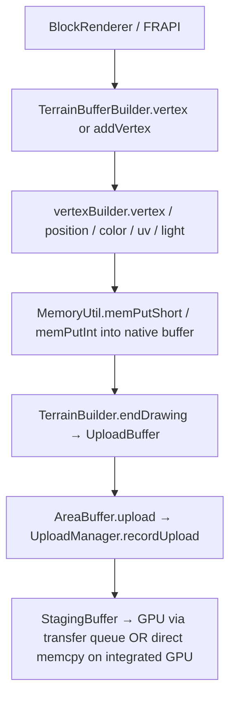

# Vertex Buffer Structural Map

## Active Format: `COMPRESSED_TERRAIN` — `CompressedVertexBuilder`

**Ground-truth stride = 16 bytes** (from `VertexBuilder.java:72`, `VERTEX_SIZE = 16`). The `TerrainBufferBuilder` uses `format.getVertexSize()` as its `vertexSize` advance per vertex (line 44 of `TerrainBuilder.java`), and this must equal 16 for correctness — see the discrepancy note below.

```
┌──────────────────────────────────────────────────────────────────┐
│ COMPRESSED_TERRAIN vertex — 16 bytes                             │
├─────────┬────────────┬───────────┬──────────────────────────────┤
│ Byte(s) │ Field      │ Wire type │ Encoding / notes             │
├─────────┼────────────┼───────────┼──────────────────────────────┤
│  0 –  1 │ Position X │ int16     │ (x * 2048.0f) – 8192         │
│  2 –  3 │ Position Y │ int16     │ same                         │
│  4 –  5 │ Position Z │ int16     │ same                         │
│  6 –  7 │ Light      │ int16     │ (light>>>8 & 0xFF00)|(light & 0xFF) │
│  8 –  9 │ UV U       │ int16     │ u * 32768.0f                 │
│ 10 – 11 │ UV V       │ int16     │ v * 32768.0f                 │
│ 12 – 15 │ Color RGBA │ uint32    │ (a<<24)|(b<<16)|(g<<8)|r     │
└─────────┴────────────┴───────────┴──────────────────────────────┘
```

**Position encoding constants** live in `VertexBuilder.java:74–76`:
```java
POS_CONV_MUL       = 2048.0f
POS_OFFSET         = -4.0f
POS_OFFSET_CONV    = -4.0f * 2048.0f  // = –8192
// encoded = (float * 2048) – 8192
```

---

## How Vulkan Actually Sees the Buffer (`GraphicsPipeline.java:290–424`)

The Vulkan attribute descriptions are driven by `VertexFormatMixed.getOffset(i)` (injected by `VertexFormatMixin.java:32`), which reads the MC builder's `IntList` of offsets. The element offsets **override** the local `offset` counter in `getAttributeDescriptions` at line 420 — that entire accumulated local `offset` is dead code. The three Vulkan attributes for `COMPRESSED_TERRAIN` are:

| VkVertexInputAttributeDescription | Location | VkFormat | Byte offset |
|---|---|---|---|
| Position | 0 | `VK_FORMAT_R16G16B16A16_SINT` (8 bytes) | 0 |
| PackedUVLight | 1 | `VK_FORMAT_R32_UINT` (4 bytes) | 8 |
| Color | 2 | `VK_FORMAT_R32_UINT` (4 bytes) | 12 |

Key architectural insight: **bytes 6–7 (packed light) are deliberately stored in the W component of the position SINT16×4 vector**. The shader receives `Position.w = packed_light`. The element is named "PackedUVLight" but its actual bytes (8–11) only carry UV; the light rides in the position's implicit W slot. This is the only way to reconcile a 16-byte stride with the 3-element format declaration.

> ⚠️ **Stride mismatch to watch:** `ELEMENT_POSITION_INT16` declares `SHORT × 3 = 6 bytes`, but `GraphicsPipeline` maps POSITION+SHORT to `VK_FORMAT_R16G16B16A16_SINT` and advances by 8 bytes. If `VertexFormat.getVertexSize()` uses MC's raw element arithmetic (6+4+4 = 14), the Vulkan binding stride would be 14 but the buffer stride is 16 — a 2-byte slip per vertex. This only works correctly if MC's `VertexFormat.Builder` pads SHORT×3 to 8 bytes. Verifiable with a quick `LOGGER.debug("stride={}", COMPRESSED_TERRAIN.getVertexSize())` at startup.

---

## Legacy/Unused: `DefaultVertexBuilder` (TERRAIN format)

For reference — `VERTEX_SIZE = 32 bytes`, all floats/ints. There's a sarcastic `// Why do you keep this?` comment in `CustomVertexFormat.java:23`. Don't touch it.

```
 0– 3: X (float)      4– 7: Y (float)      8–11: Z (float)
12–15: Color (int32)
16–19: U (float)     20–23: V (float)
24–25: Light low (short)   26–27: Light high (short)
28–31: Packed normal (int32)
```

---

## Where Primitive Writes Happen

All writes are in **`VertexBuilder.java`** via `MemoryUtil` unsafe puts:

| Call site | Method | Offset | Field |
|---|---|---|---|
| `CompressedVertexBuilder.vertex()` line 85 | `memPutShort` | `ptr + 0` | X |
| `CompressedVertexBuilder.vertex()` line 86 | `memPutShort` | `ptr + 2` | Y |
| `CompressedVertexBuilder.vertex()` line 87 | `memPutShort` | `ptr + 4` | Z |
| `CompressedVertexBuilder.vertex()` line 90 | `memPutShort` | `ptr + 6` | Light |
| `CompressedVertexBuilder.vertex()` line 92 | `memPutShort` | `ptr + 8` | U |
| `CompressedVertexBuilder.vertex()` line 93 | `memPutShort` | `ptr + 10` | V |
| `CompressedVertexBuilder.vertex()` line 95 | `memPutInt`   | `ptr + 12` | Color |

The individual setters (`position`, `color`, `uv`, `light`, `normal`) all target the same offsets — `normal()` is a no-op in compressed mode. The call chain is:



---

## Vulkan Memory Allocation Flags — Where They Live

The flags funnel through a single choke point:

**`MemoryManager.java:131`** → `MemoryManager.createBuffer(Buffer, size, usage, properties)` → `VmaAllocationCreateInfo.requiredFlags(properties)` at line 117.

The `properties` value originates from the `MemoryType` subclasses in **`MemoryTypes.java`**:

| Class | `requiredFlags` passed | Notes |
|---|---|---|
| `DeviceLocalMemory.createBuffer()` line 73 | `VK_MEMORY_HEAP_DEVICE_LOCAL_BIT` | ⚠️ Wrong constant — should be `VK_MEMORY_PROPERTY_DEVICE_LOCAL_BIT`. Both happen to equal `0x1`, so it works, but it's semantically wrong. |
| `HostCoherentMemory.createBuffer()` line 137 | `HOST_VISIBLE \| HOST_COHERENT` | Correct for staging/uniform |
| `DeviceMappableMemory.createBuffer()` line 166 | `DEVICE_LOCAL \| HOST_VISIBLE` | ⚠️ Missing `HOST_COHERENT` — may require manual VMA flushes |
| `HostLocalFallbackMemory.createBuffer()` line 152 | `HOST_VISIBLE \| HOST_COHERENT` | Fallback, correct |

**GPU_MEM selection** in `createMemoryTypes()` lines 22–37: iterates memory types and picks the first `DEVICE_LOCAL` heap, branching on whether it is also `HOST_VISIBLE`:

```java
// MemoryTypes.java:27–31
if ((propertyFlags & VK_MEMORY_PROPERTY_DEVICE_LOCAL_BIT) != 0 && GPU_MEM == null) {
    if ((propertyFlags & VK_MEMORY_PROPERTY_HOST_VISIBLE_BIT) != 0)
        GPU_MEM = new DeviceMappableMemory(memoryType, heap);  // ← integrated GPU lands here
    else
        GPU_MEM = new DeviceLocalMemory(memoryType, heap);     // ← discrete GPU lands here
}
```

On integrated GPUs (Intel UHD, AMD APU, etc.) there is only one heap and it is always `DEVICE_LOCAL | HOST_VISIBLE | HOST_COHERENT`, so `GPU_MEM = DeviceMappableMemory`. This already skips the staging buffer because `MappableMemory.copyToBuffer()` does a direct `VUtil.memcpy()` instead of going through `StagingBuffer`. The only missing piece is `HOST_COHERENT`.

---

## 5-Line Host-Visible/Device-Local Override for Integrated Graphics

Add this inner class to `MemoryTypes.java` right after `DeviceMappableMemory`, then swap the one instantiation:

```java
// MemoryTypes.java — drop in after DeviceMappableMemory
static class IntegratedGpuMemory extends MappableMemory {
    IntegratedGpuMemory(VkMemoryType vkMemoryType, VkMemoryHeap vkMemoryHeap) {
        super(Type.DEVICE_LOCAL, vkMemoryType, vkMemoryHeap);
    }
    @Override
    public void createBuffer(Buffer buffer, long size) {
        MemoryManager.getInstance().createBuffer(buffer, size,
            VK_BUFFER_USAGE_TRANSFER_DST_BIT | VK_BUFFER_USAGE_TRANSFER_SRC_BIT | buffer.usage,
            VK_MEMORY_PROPERTY_DEVICE_LOCAL_BIT | VK_MEMORY_PROPERTY_HOST_VISIBLE_BIT | VK_MEMORY_PROPERTY_HOST_COHERENT_BIT);
    }
}
```

Then in `createMemoryTypes()` at line 29, change the one line:
```java
// Before:
GPU_MEM = new DeviceMappableMemory(memoryType, heap);
// After:
GPU_MEM = new IntegratedGpuMemory(memoryType, heap);
```

**Why this is correct:**
- `MappableMemory.copyToBuffer()` (inherited) already does a direct `memcpy`, so no staging buffer overhead on integrated hardware.
- Adding `HOST_COHERENT` to the VMA `requiredFlags` means CPU writes are immediately GPU-visible without `vmaFlushAllocation` — essential since `UploadManager` never explicitly flushes.
- The fallback path in `createMemoryTypes()` (lines 43–58) also has a `DeviceMappableMemory` instantiation — apply the same change there for consistency.
- `AreaBuffer`, `VBO.upload()`, and `VkGpuBuffer` all go through `MemoryTypes.GPU_MEM`, so this single change covers all vertex/index buffer allocations.
